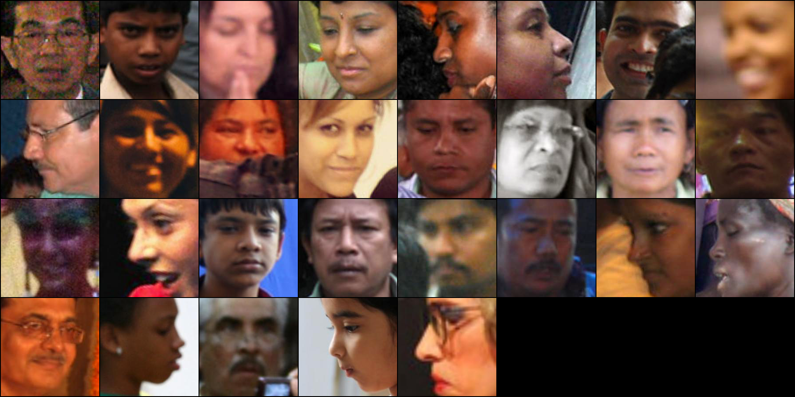

# Blurriness Detection

A heuristic model based on Laplacian Standard deviations.
Learning based models are yet to come.

## Detection threshold

For `StdLaplacian`, **3.8** seems to be a good threshold.  
Faces with StdLaplacian less than 3.8 can be considered blurry.  

The script `blur_test.py` is an example on how to do a grid search for the ideal threshold on an image folder.

## TODO

- [ ] build a blur face datasets
- [ ] train a lightweight model for blur detection
